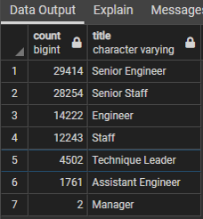
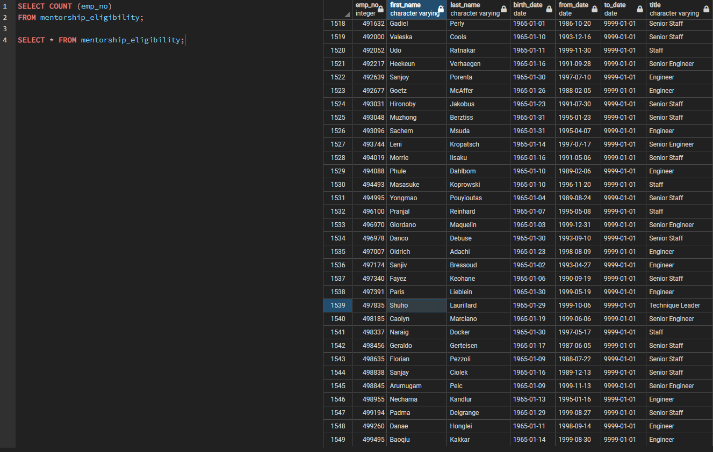
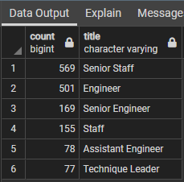

# An Assessment of the Impact of Retiring Employees From the Company "Pewlett-Hackard"
### *Analysis SQL File*: [Employee_Database_challenge](Employee_Database_challenge.sql)
#### *Database CSV Files*: [Data](Data)

## **Analysis Overview:**
This analysis was conducted with the intent of determining how many employees of the company "Pewlett-Hackard" will be retiring soon, and to provide different tables that break down the list of employees into more accessible data based on the criteria that most interest the viewer at the time. Having been presented such a large collection of data across many CSV files containing different columns of relevant information, the creation of a database with PostgreSQL software allows for a more efficient and customizable platform to analyze and create CSV files. This analysis was conducted across tens of thousands of rows of data values and the results were provided in easily accessible CSV files to be read or analyzed further with other relationships drawn between the data sections. The greater speed and ease of access this analysis affords the management team of the company will be invaluable as the concluded number of retiring employees is over 90,000 names and important information about the mentorship program is also presented in the results section.

## **Results:**
The results of this analysis have been broken down into different tables, each of which has been exported into its own CSV file for easy access, and those tables are included in links below as well as easily replicated through the SQL code included in the file at the top of this page. The analysis had two parts, with part one concluding the number of retiring employees by title in the company, and part two compiling a list of employees eligible for the Mentorship Program offered in the company for qualifying employees.
### Retiring Employees by Title:
This first part began with joining the Employees table with the Titles table at their primary keys to gain all necessary information for the employees' positions in the company currently, and this data was then filtered through to reach the age range of employees that will be eligible for retirement soon based on the birth date listed. This new table was titled "retirement_titles" and a link to the CSV file with the table is included here: *[retirement_titles](Data/retirement_titles.csv)*
This table, unfortunately, included cases of multiple titles for the same employee as they changed titles over the years and was reduced down a list of unique cases for the most recent title each employee has held. This table is included in a CSV file here: *[unique_titles](Data/unique_titles.csv)*
At this point, the names available were able to counted and presented in a table named "retiring_titles" that listed the total number of retirement-age employees for each job title in the company. The CSV file and a screenshot of the resulting table is included below.

#### [retiring_titles](Data/retiring_titles.csv) 

Based on this table, two conclusions can be drawn about the numbers of retirement-aged employees:
1. The majority of retiring employees will be from the senior positions in the company, with the number of senior positions expected to be vacated at twice the amount of the regular level positions for those titles.
2. With the total number of employees being around 300,000, the total number of retiring employees will be around 30% with the sum total of retiring employees being 90,398. This shows, indeed, that the number of retiring employees will have a major impact on the company.

### Number of Mentorship Eligible Employees
To determine the number of employees eligible for the mentorship program the Employees, Department Employees, and Titles tables were joined on their primary key emp_no and the resulting data was filtered select employees with birth dates in the year 1965. The resulting table was then named "mentorship_eligibility", and a screenshot of the table along with a link to the CSV file is included below.

#### [mentorship_eligibility](Data/mentorship_eligibility.csv) 

Based on this new table, two more conclusions can be made in addition to the list of conclusions from the part listed above:
1. The total number of eligible employees is much lower than the number of employees nearing retirement, with the total number of eligible employees being 1,549.
2. With such a small age range of employees that would be considered eligible for the mentorship program compared to the range of employees nearing retirement age, the likelihood of an ideal ratio between retiring employees and mentorship-eligible employees was set to be low from the beginning.

## **Conclusions:**
The results listed above and the immediate conclusions drawn from them have provided some basic insight into the implications of this analysis, but they also allow for drawing much larger conclusions for the company's status in the near future. With the upcoming loss of nearly 30% of employees within the retirement age range, reducing the negative impact of this "silver tsunami" is likely to be difficult and to just reduce a third of the upcoming vacant positions the company would need to fill 30,000 positions. For a preferable reduction of, perhaps, 10% loss in the company's staff, the company would need to fill around 60,000 job positions by the time the current employees eventually do retire. 
In addition to this conclusion, the question of how much impact will the mentorship program have on bringing new hires up to the level of the company's ideal workers is even more important. By adding some new code to the intial queries conducted in this analysis, it is possible to create a new table that breaks down the number of mentorship-eligible employees by job title similar to the "retiring_titles". A screenshot of the table is included below, along with a link to the CSV file that holds the exported table.

#### [mentorship_counts](Data/mentorship_counts.csv) 

Based on this table, the 1,549 mentorship-eligible employees are broken down by title to show how much impact the program will have relative to the number of employees expected to retire. This table shows a troubling fact about the company's expected state after the "silver tsunami": despite the basic numbers showing the max number of mentors would need to each mentor 58 new hires at the very least, the largest number of vacancies will be in the Senior Engineer position and the number of eligible employees to be mentors is among the lower numbers in the titles shown in this table. There is a large percentage of engineers that can fit the mentorship program's criteria however, with the majority being less senior employees, it can be reasonable to expect the quality of the mentorship will not be the same between the two levels and will be reflected in the performances of the new hires.

