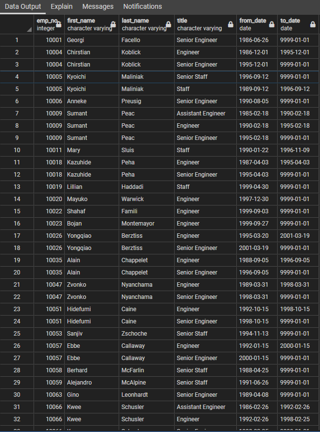

# An Assessment of the Impact of Retiring Employees From the Company "Pewlett-Hackard"
### *Analysis SQL File*: [Employee_Database_challenge](Employee_Database_challenge.sql)
#### *Database CSV Files*: [Data](Data)

## **Analysis Overview:**
This analysis was conducted with the intent of determining how many employees of the company "Pewlett-Hackard" will be retiring soon, and to provide different tables that break down the list of employees into more accessible data based on the criteria that most interest the viewer at the time. Having been presented such a large collection of data across many CSV files containing different columns of relevant information, the creation of a database with PostgreSQL software allows for a more efficient and customizable platform to analyze and create CSV files. This analysis was conducted across tens of thousands of rows of data values and the results were provided in easily accessible CSV files to be read or analyzed further with other relationships drawn between the data sections. The greater speed and ease of access this analysis affords the management team of the company will be invaluable as the concluded number of retiring employees is over 90,000 names and important information about the mentorship program is also presented in the results section.

## **Results:**
The results of this analysis have been broken down into different tables, each of which has been exported into its own CSV file for easy access, and those tables are included in links below as well as easily replicated through the SQL code included in the file at the top of this page. The analysis had two parts, with part one concluding the number of retiring employees by title in the company, and part two compiling a list of employees eligible for the Mentorship Program offered in the company for qualifying employees.
### Retiring Employees by Title:
This first part began with joining the Employees table with the Titles table at their primary keys to gain all necessary information for the employees' positions in the company currently, and this data was then filtered through to reach the age range of employees that will be eligible for retirement soon based on the birth date listed. This new table was titled "retirement_titles" and a screenshot of the resulting names is included below, along with a link to the CSV file with the table.

[retirement_titles](Data/retirement_titles.csv)

## **Conclusions:**

